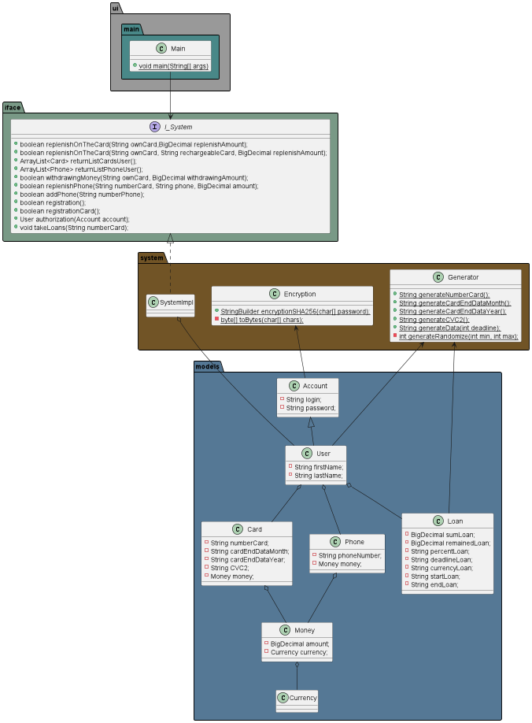
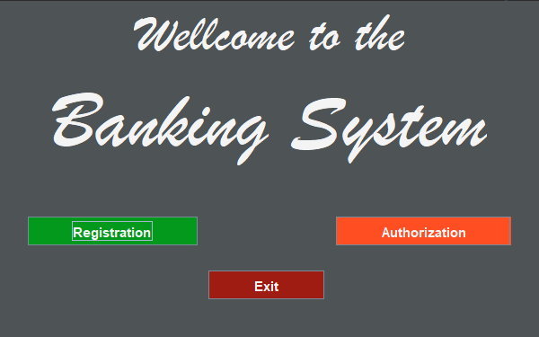
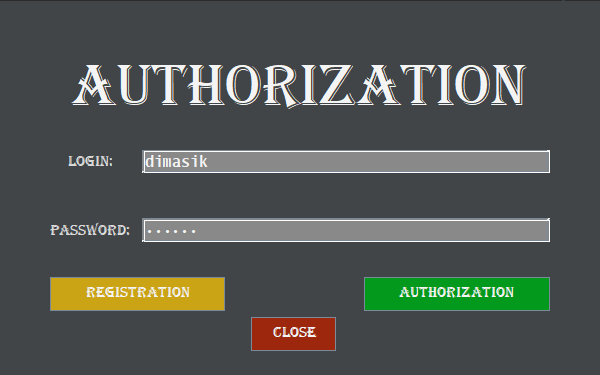
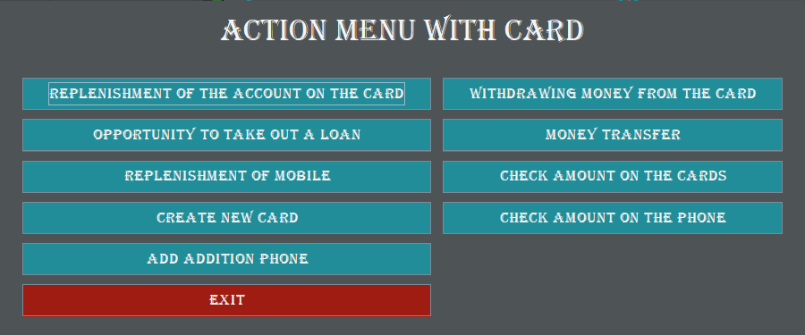
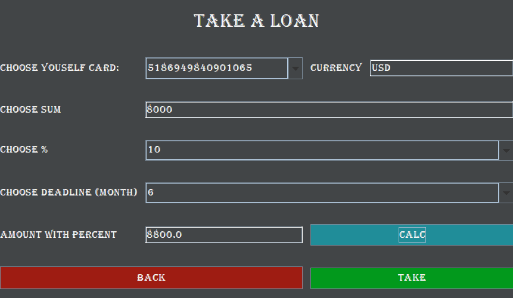
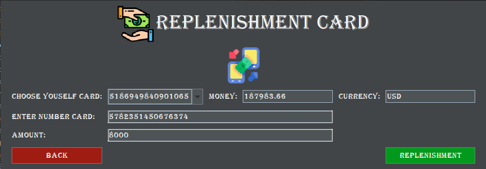
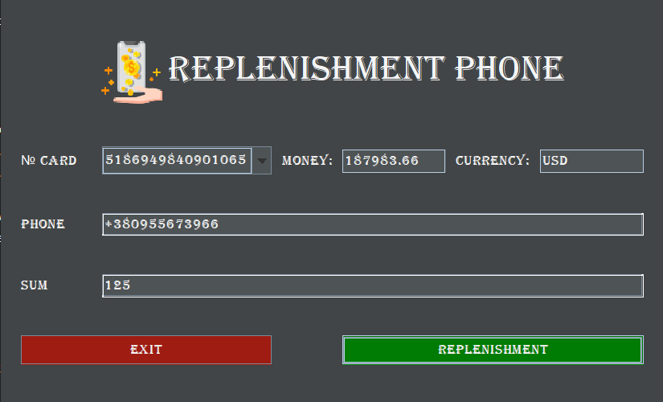

# Banking System 🏦

## Preview, I hope you enjoy it 😊
1. This project uses jdk 11, JDBC driver, MySQL, Swing;
2. Project consists of 3 levels such as: ui, domain, dao;
3. Project uses `Swing` interface;
4. Project uses db `MySQL` to store information.
5. Project uses `encryption sh256` for login and password user.
6. System can be extended.
7. For testing the system uses `JUnit4`.
8. System uses `Log4j`.

## Features
☑️Sing in;
<br>☑️Registration;
<br>☑️Menu acts;
<br>☑️Replenishment of the account on the card;
<br>☑️Withdrawing money from the card;
<br>☑️Opportunity to take out a loan;
<br>☑️Money transfer;
<br>☑️Replenishment of mobile;
<br>☑️Create new card;
<br>☑️Add addition phone;
<br>☑️Check amount on the card;
<br>☑️Check amount on the phone.

## Launch guide
To run this project you will need to install:

JDK 11 or higher
MySQL RDBMS

If you have downloaded a project and want to run it with your own database then you have to create enum which will be stored in a package `src/main/java/dao/env` and put your environment variables.
```java
public enum Environment {
    DB_URL("jdbc:RDBMS//host:port/nameDB"),
    USERNAME("username"),
    PASSWORD("password");

    private final String environmentValue;

    Environment(String environmentValue) {
        this.environmentValue = environmentValue;
    }

    public String getEnvironmentValue() {
        return environmentValue;
    }
}
```

Here are the steps for you to follow:

- Add this project to your IDE as Maven project.
- If necessary, configure Java SDK 11 in Project Structure settings.
- You can change path to your log file and  its name in `src/main/resources/log4j.properties` on line 9.
- First, you will need to register as a new user.
- By default, the USER role is assigned to all registered users.

## Database
You can download database from this project. 
<br>The Sql file is in this path: `src/main/resources/sql/`.
<br><i><b>Visually it looks like this:</b></i>


## Diagram business logic
The diagram was created using plugin `plantUML`.


## Program testing
### Main Menu

### Authorization

### Registration

### Register card

### Action Menu

All functions of the action menu will be discussed below.👇
- Replenishment of the account on the card

- Withdrawing money from the card

- Opportunity to take out a loan

- Money transfer

- Replenishment of mobile

- Add addition phone

- Check amount on the card

- Check amount on the phone


